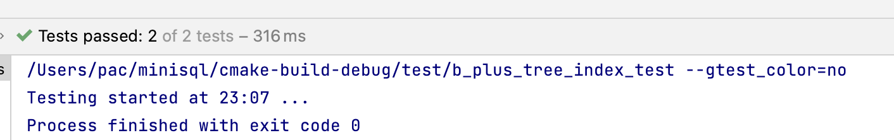
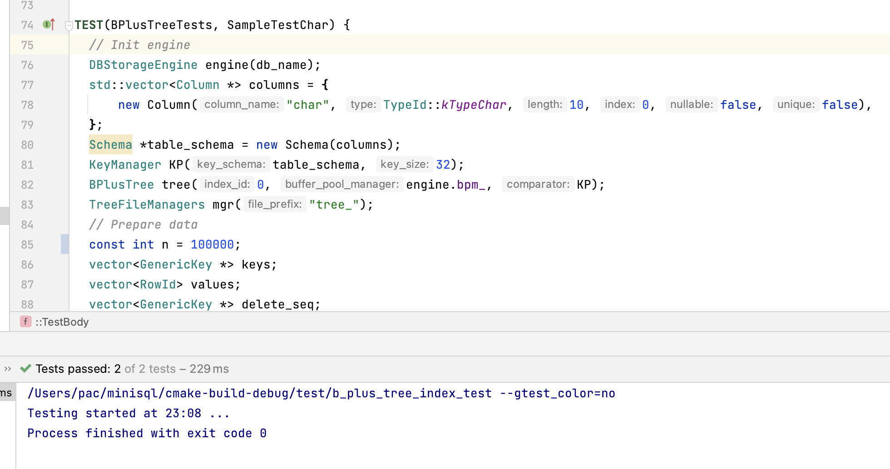
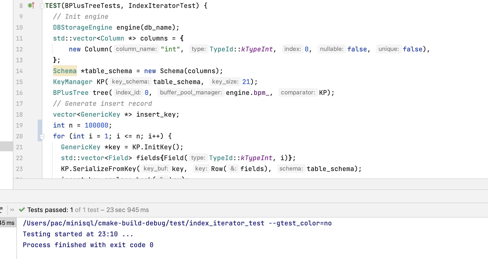
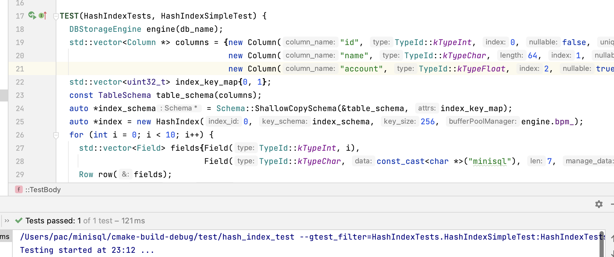
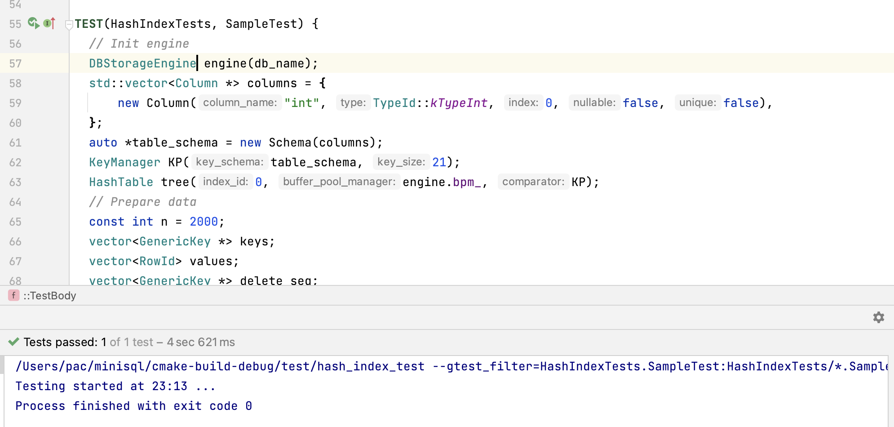
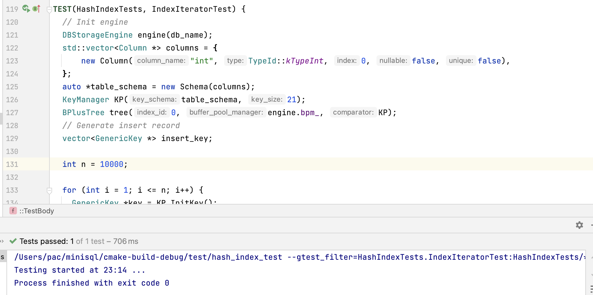

# MiniSQL 个人报告

<center>张志心，3210106357</center>

## 实验概述

MiniSQL PART3 部分为 Index Manager，负责数据表索引的实现和管理。

本部分主要实现的功能如下：

+ 创建索引和删除索引；
+ 点查找和范围查找（依照键值）；
+ 插入和删除键值对。

添加数据的一个属性添加索引的目的是加快针对该属性的相关操作。索引的方式有很多种，本次实验主要是实现了 B+ 树索引。此外，本人还是实现了 Hash 索引。

在此基础上，针对两种索引方式，提供了充足的随机样例测试，来验证两种索引的稳定性和正确性。

## B+ 树索引设计思路

### B+树数据页

B+ 树的每个节点都是一个数据页，数据页分为页头和存储数据两个部分。根据 B+ 树的形态，将数据页分为 `Internal Page` 和 `Leaf Page` 两个子类，它们都是 `BPlusTreePage` 的子类。在数据页中，序列化后的索引键值和对应的Value成对的存储在 `data_[]` 中，对于内点，存储的 Value 是子节点的 `page_id`；对于叶子点，存储的 Value 是数据表中该键值对应的 `row_id`。

叶节点的 Header 中比内部节点多存储了一个 `next_page_id_` 表示按照顺序的下一个 叶节点的 `page_id` ，在范围查找的时候使用，辅助迭代器的实现。因此叶节点的各个操作相比内部节点，都需要多一个维护 `next_page_id_` 的逻辑。而内部节点因为其还有子节点，因此在移动键值对的时候，会改变子节点的 `parent_id`，需要同步维护。

修改数据页的时候，需要使用 `buffer pool manager` 的 `FetchPage` 方法，Pin 住当前页，使用完后再调用其 `UnpinPage` 方法将其 Unpin，如果此时修改了数据页，需要将其标记为脏页。

#### `BPlusTreePage` 类

⚠️ 注意 `BPlusTreePage` 并不是 `Page` 的子类。

```c++
class BPlusTreePage {
 public:
  bool IsLeafPage() const; // 判断是否是 LeafPage
  bool IsRootPage() const; // 判断是否是 RootPage（B+树的页）
  void SetPageType(IndexPageType page_type); // 设置类型
  int GetKeySize() const; // 返回索引键长
  void SetKeySize(int size); // 设置索引键长
  int GetSize() const; // 返回存储的索引键的数量
  void SetSize(int size); // 设置索引键的数量
  void IncreaseSize(int amount); // 使用增量修改索引键的数量
  int GetMaxSize() const; // 返回该页最多能存储多少索引键（+1）
  void SetMaxSize(int max_size); // 设置最多能存储多少索引键（+1）
  int GetMinSize() const; // 设置该页至少要存储多少索引键
  page_id_t GetParentPageId() const; // 返回父亲节点的 page_id
  void SetParentPageId(page_id_t parent_page_id); // 设置父节点id
  page_id_t GetPageId() const; // 返回 page_id
  void SetPageId(page_id_t page_id); // 设置 page_id
  void SetLSN(lsn_t lsn = INVALID_LSN); // 设置 LSN（未使用）
  private:
  IndexPageType page_type_; // 标记数据页是中间结点还是叶子结点；
  int key_size_; // 当前索引键的长度
  lsn_t lsn_; // 数据页的日志序列号，目前不会用到
  int size_; // 当前结点中存储Key-Value键值对的数量
  int max_size_; // 当前结点最多能够容纳Key-Value键值对的数量
  page_id_t parent_page_id_; // 父结点对应数据页的page_id
  page_id_t page_id_; // 当前结点对应数据页的page_id
```

#### `BPlusTree InternalPage` 类

```c++
#define INTERNAL_PAGE_HEADER_SIZE 28 // 页头偏移量
class BPlusTreeInternalPage : public BPlusTreePage {
 public:
  void Init(page_id_t page_id, page_id_t parent_id = INVALID_PAGE_ID, int key_size = UNDEFINED_SIZE,
            int max_size = UNDEFINED_SIZE); // 初始化函数
  GenericKey *KeyAt(int index); // 获取 index 位置的键值
  void SetKeyAt(int index, GenericKey *key); // 设置 index 位置键值
  int ValueIndex(const page_id_t &value) const;
    // 查找 value 对应的 index
  page_id_t ValueAt(int index) const; // 查找 index 位置的 value
  void SetValueAt(int index, page_id_t value); // 设置 index 位置 value
  void *PairPtrAt(int index); // 获取 data_[index] 位置指针
  void PairCopy(void *dest, void *src, int pair_num = 1); // 键值对拷贝
  page_id_t Lookup(const GenericKey *key, const KeyManager &KP);
  // 查找 key 所对应的 value
  void PopulateNewRoot(const page_id_t &old_value, GenericKey *new_key, const page_id_t &new_value);
 // 将新的根节点设置为 old_value + new_key + new_value
 // PopulateNewRoot 只在分裂根节点的时候使用（此时要创建一个新的根）
  int InsertNodeAfter(const page_id_t &old_value, GenericKey *new_key, const page_id_t &new_value);
 // 在 old_value 之后加入一个新的键值对（插入时用）
  void Remove(int index);
 // 删除第 index 个键值对
  page_id_t RemoveAndReturnOnlyChild();
 // 将唯一的孩子移除然后返回（并未用到该函数）
  void MoveAllTo(BPlusTreeInternalPage *recipient, GenericKey *middle_key, BufferPoolManager *buffer_pool_manager);
  // 键值对全部移动
  void MoveHalfTo(BPlusTreeInternalPage *recipient, BufferPoolManager *buffer_pool_manager);
 // 键值对移动一半
  void MoveFirstToEndOf(BPlusTreeInternalPage *recipient, GenericKey *middle_key,
                        BufferPoolManager *buffer_pool_manager);
 // 将第一个键值对移动到 recipient 页的最后一个
  void MoveLastToFrontOf(BPlusTreeInternalPage *recipient, GenericKey *middle_key,
                         BufferPoolManager *buffer_pool_manager);
 // 将最后一个键值对移动到 recipient 页的第一个
 private:
  void CopyNFrom(void *src, int size, BufferPoolManager *buffer_pool_manager);
 // 新增从外部拷贝的 N 个键值对
  void CopyLastFrom(GenericKey *key, page_id_t value, BufferPoolManager *buffer_pool_manager);
 // 从外部拷贝一个键值对于末尾
  void CopyFirstFrom(page_id_t value, BufferPoolManager *buffer_pool_manager);
 // 从外部拷贝一个键值对于开头
  char data_[PAGE_SIZE - INTERNAL_PAGE_HEADER_SIZE];
 // 键值对存储数组
};
```

#### `BPlusTree LeafPage` 类

```c++
#define LEAF_PAGE_HEADER_SIZE 32
class BPlusTreeLeafPage : public BPlusTreePage {
 public:
  // method to set default values
  void Init(page_id_t page_id, page_id_t parent_id = INVALID_PAGE_ID, int key_size = UNDEFINED_SIZE,
            int max_size = UNDEFINED_SIZE);
  // helper methods
  page_id_t GetNextPageId() const; // 返回 next_page_id_
  void SetNextPageId(page_id_t next_page_id); // 设置 next_page_id_
  GenericKey *KeyAt(int index);
  void SetKeyAt(int index, GenericKey *key);
  RowId ValueAt(int index) const;
  void SetValueAt(int index, RowId value);
  int KeyIndex(const GenericKey *key, const KeyManager &comparator); // 返回 key 所对应的 index
  void *PairPtrAt(int index);
  void PairCopy(void *dest, void *src, int pair_num = 1);
  std::pair<GenericKey *, RowId> GetItem(int index); // 返回键值对
  // insert and delete methods
  int Insert(GenericKey *key, const RowId &value, const KeyManager &comparator);
  bool Lookup(const GenericKey *key, RowId &value, const KeyManager &comparator); // 返回是否存在当前 key，并把对应 RowId 存在 value 中
  int RemoveAndDeleteRecord(const GenericKey *key, const KeyManager &comparator); // 删除键值对
  // Split and Merge utility methods
  void MoveHalfTo(BPlusTreeLeafPage *recipient);
  void MoveAllTo(BPlusTreeLeafPage *recipient);
  void MoveFirstToEndOf(BPlusTreeLeafPage *recipient);
  void MoveLastToFrontOf(BPlusTreeLeafPage *recipient);
 private:
  void CopyNFrom(void *src, int size);
  void CopyLastFrom(GenericKey *key, const RowId value);
  void CopyFirstFrom(GenericKey *key, const RowId value);
  page_id_t next_page_id_{INVALID_PAGE_ID};
  char data_[PAGE_SIZE - LEAF_PAGE_HEADER_SIZE];
};
```

#### 部分函数实现细节

(1) `LeafPage::KeyIndex()`：二分查找 Key 所对应的 index。

```c++
int LeafPage::KeyIndex(const GenericKey *key, const KeyManager &KM) {
  if(GetSize() == 0) {
    return 0;
  }
  int l = 0, r = GetSize() - 1, index = GetSize();
  // binary search
  while(l <= r) {
    int mid = (l + r) >> 1;
    int Compare_result = KM.CompareKeys(key, KeyAt(mid));
    if(Compare_result == 0) {
      index = mid;
      break;
    }  else if(Compare_result < 0) {
      index = mid;
      r = mid - 1;
    } else {
      l = mid + 1;
    }
  }
  return index;
}
```

(2) `InternalPage::Lookup`：二分查找 Key 对应的 value

```c++
page_id_t InternalPage::Lookup(const GenericKey *key, const KeyManager &KM) {
  // index from 0 to GetSize()-1
  int index = 0, l = 1, r = GetSize() - 1;
  // binary search
  while(l <= r) {
      int mid = (l + r) >> 1;
      int Compare_result = KM.CompareKeys(key, KeyAt(mid));
      if(Compare_result == 0) {
          index = mid;
          break;
      }  else if(Compare_result < 0) { // key < mid->key
          r = mid - 1;
      } else {
          index = mid;
          l = mid + 1;
      }
  }
  return ValueAt(index);
}
```

(3) `InternalPage::CopyNFrom`：拷贝 N 个键值对到末尾，修改对应页的 `parent_id_`

```c++
void InternalPage::CopyNFrom(void *src, int size, BufferPoolManager *buffer_pool_manager) {
    PairCopy(PairPtrAt(GetSize()), src, size);
    IncreaseSize(size);
    for(int i = 1; i <= size; ++i) {
      int page_id = ValueAt(GetSize() - i);
      auto *child_page =
          reinterpret_cast<BPlusTreePage *>
          (buffer_pool_manager->FetchPage(page_id)->GetData());
      child_page->SetParentPageId(GetPageId());
      buffer_pool_manager->UnpinPage(page_id, true);
    }
}
```

### B+树索引

#### 功能介绍

B+树的创建、插入、删除、查找和释放等操作。默认所有索引为 `Unique Key`，若违反该规定则不能执行并且返回一个 `false` 状态。

当一些写操作导致B+树索引的根结点发生变化时，需要调用`BPLUSTREE_TYPE::UpdateRootPageId`完成`root_page_id`的变更和持久化。

实现细节上设计到函数对于 `LeafPage` 和 `InternalPage` 的特化，对于不同类型节点的函数实现上有细微差异。

#### BPlusTree Index

`BPlusTree Index` 是 `Index` 的子类，它的成员包括一个 Keymanager 用于处理键值之间的比较，以及一个 BPlusTree 作为数据存储的容器， 具体定义如下：

```c++
class BPlusTreeIndex : public Index {
 public:
 // 构造函数
    BPlusTreeIndex(index_id_t index_id, IndexSchema *key_schema, size_t key_size, BufferPoolManager *buffer_pool_manager);
 // 增加索引
  dberr_t InsertEntry(const Row &key, RowId row_id, Transaction *txn) override;
 // 移除索引
  dberr_t RemoveEntry(const Row &key, RowId row_id, Transaction *txn) override;
 // 扫描索引
  dberr_t ScanKey(const Row &key, std::vector<RowId> &result, Transaction *txn, string compare_operator = "=") override;
 // 删除索引
  dberr_t Destroy() override;
 // 索引开始迭代器
  IndexIterator GetBeginIterator();
  IndexIterator GetBeginIterator(GenericKey *key);
// 索引结束迭代器
  IndexIterator GetEndIterator();
 protected:
  // comparator for key
  KeyManager processor_;
  // container
  BPlusTree container_;
};
```

#### BPlusTree

BPlusTree 是 B+ 树索引的核心，用于存放数据，B+ 树以 BPlusTree Page 作为节点，具有增删改查的功能，并且自动维护 B+ 树的结构。

B+ 树的根节点序号存放在 `Index_Roots_Page` 上，这个数据页用于根据索引的序号寻找相应的 B+ 树根节点。所有对于根节点序号的修改操作都应该同步修改 `Index_Roots_Page` 上的对应的 `root_id`，所有对于根索引页的修改操作都调用 `UpdateRootPageId` 函数完成。

1. 查找操作 `GetValue`
   1. `FindLeafPage`：该方法从根开始往下，寻找一个满足条件的叶子结点，它有两个功能，一个找到位于最左边的叶子（也就是保存了最小的键值对的叶子），另一个是找到存放键值区间包含了给定键值的叶子。该函数是很重要的辅助函数，用于查找叶子结点和获取相应数据；
   2. 查找过程：首先调用 `FindLeafPage`，找到对应的叶子结点，然后调用叶子结点的查找方法，找到对应的 Value。
2. 增加操作 `Insert`
   1. `StartNewTree`：如果当前 B+ 树为空，需要加入一个新的根节点，同时，还应该根据传入的键值对情况计算 B+ 树叶子节点的最大键值对数量（这个过程本应该在构造阶段完成，但是由于构造函数中并没有关于 `page_id_t` 和 `rowId` 的信息，因此在新建第一个节点的时候更新更合适）。
   2. `InsertIntoLeaf`：如果当前节点不为空，则 B+ 树应该找到对应的叶子节点，并试图为其插入一个新的键值对，这个过程仍然需要先找到对应的叶子节点。如果插入之后，叶子节点的键值对数量超过了上限，则需要将其分裂成两个节点，使用 `Split` 方法。同时，调用 `InsertIntoParent` 函数，向父亲节点插入指向新节点的索引。这个时候可能会触发新的一轮分裂，直到有一轮插入之后，当前节点的键值对数量满足要求。
   3. 如果分裂的节点为根节点，需要新建一个根节点，同时更新 `Index_Roots_Page`。

3. 删除操作 `Remove`
   1. 首先找到待删除索引键所在的叶子节点并删除。如果此时节点的键值对数量少于最少数量则需要考虑重新分配或者合并节点两个策略：
   2. 重新分配 `Redistribute`：考虑相邻节点，如果相邻节点减少一个键值对之后仍然满足数量要求，那么直接移动一个键值对到该节点。
   3. 合并节点 `Coalesce`：如果相邻节点不能满足要求，那么就合并两个节点，同时从父亲节点中相应删除被合并的其中一个节点的索引。如果父亲节点也少于最小键值对数量，则会触发新一轮合并或者重新分配，以此递归。两种策略的调用逻辑在 `CoalesceOrRedistribute` 函数中。
   4. 如果当前节点为根节点，则不用考虑少于最小键值对数量的情况，但是要注意，如果将树删至空，则根页删除，将rootid修改成INVALID；如果根节点只有一个键值对，那么唯一的儿子将替代其变为根节点。两种情况都应该更新 `Index_Roots_Page`。

### B+树索引迭代器

迭代器将所有的叶结点组织成为一个单向链表，沿着特定方向有序遍历叶结点数据页中的每个键值对。

有关迭代器的使用被封装在 `IndexIterator` 类中。一个索引迭代器包括有如下成员和成员函数：

```c++
class IndexIterator {
 public:
  explicit IndexIterator(); // 默认构造
  explicit IndexIterator(page_id_t page_id, BufferPoolManager *bpm, int index = 0); // 参数构造
  ~IndexIterator(); // 析构函数
  std::pair<GenericKey *, RowId> operator*(); // 取值操作
  IndexIterator &operator++(); // 迭代器自增操作
  bool operator==(const IndexIterator &itr) const; // 比较操作
  bool operator!=(const IndexIterator &itr) const;
 private:
  page_id_t current_page_id{INVALID_PAGE_ID}; // 迭代器当前所在叶子节点的 page_id
  LeafPage *page{nullptr}; // 当前所在叶子的指针
  int item_index{0}; // 当前指向的键值对的位置index
  BufferPoolManager *buffer_pool_manager{nullptr};
    // 缓存管理指针，用于执行 FetchPage 和 UnpinPage 方法。
};
```

`begin()`：有两种 `begin()` 方法，一个是找到索引开始位置，调用 `FindLeafPage` 找到最左边的叶子节点即可；还有一个是找到指向给定 key 值的迭代器，同样可以通过 `FindLeafPage` 找到相应页。

`end()`：考虑到 `end()` 不应该指向 B+ 树中任何一个键值对（因为迭代器遍历过程是左闭右开的，所以考虑给 `end()` 赋予一个不合法值，这样做可能会在特定情况下导致出错，但是考虑到本项目中对于迭代器的使用只有如下方法：

```c++
for(auto it = xx.Begin(); it != xx.end(); ++it)；
```

可行的替代做法是找到当前最右边的叶子节点，并取 `index = size_ + 1` 的位置，但是那样就会导致每次比较 `it != xx.end()` 的时候都要扫面一遍树上路径来找到 `end()` 值，不是非常高效。因此本项目采用直接赋常值的方法。

迭代器自增操作：

```c++
IndexIterator &IndexIterator::operator++() {
    // 跳转到下一页，同时将当前页 unpin
  if(++item_index == page->GetSize() && page->GetNextPageId() != INVALID_PAGE_ID) {
    auto * next_page = reinterpret_cast<::LeafPage *>
        (buffer_pool_manager->FetchPage(page->GetNextPageId())->GetData());
    current_page_id = page->GetNextPageId();
    buffer_pool_manager->UnpinPage(page->GetPageId(), false);
    page = next_page;
    item_index = 0; // 指向当前页的第一个键值对
  } if(item_index == page->GetSize()) {
    buffer_pool_manager->UnpinPage(current_page_id, false);
    current_page_id = INVALID_PAGE_ID;
    page = nullptr;
    item_index = 0;
    *this = IndexIterator(); // 返回 end()
  }
  return *this;
}
```

## Hash 索引设计思路

Hash 索引通过对 Key 值进行计算 hash 值，对一个 hash 值，找到对应页并存放，如果当前页满了，考虑拉链法，新增一个页连向当前页，用于存放溢出的键值。

查询的时候，首先找到对应 hash 所在的数据页（为数据页链表的表头），从当前页开始顺序查找，直到找到该键值对。

删除数据页的时候需要保证不能有空页的存在（否则会导致迭代器出错），如果一个页被删为空，则从链表中删除该页，如果一个 hash 值所对应的键值对被全部删完，则删除当前 hash 值与链表头的映射关系，释放内存。

Hash 索引的实现比 BPLusTree 简单很多，但是由于 Hash 函数设计的困难，可能造成内存消耗过大（冲突太少），或者操作时间复杂度高（冲突太多）的问题。

### Hash数据页

Hash 数据页的实现与 BPlusTreePage 类似，但由于 Hash 数据页需要连接成一个双向链表，因此需要同时保存前向后向指针。

和 BPlusTreePage 不同的是，Hash 数据页在查找键值对的时候，如果当前页没有找到，需要继续跳转到下一个页进行寻找，直到遍历整个链表。

```c++
#define HASH_PAGE_HEADER_SIZE 24

class HashPage{
 public:
  void Init(page_id_t page_id, page_id_t pre_id = INVALID_PAGE_ID, int key_size = UNDEFINED_SIZE, int max_size = UNDEFINED_SIZE);
  // helper methods
  [[nodiscard]] int GetSize() const;
  [[nodiscard]] int GetKeySize() const;
  [[nodiscard]] int GetMaxSize() const;
  void SetSize(int size);
  int GetPageId() const;
  void SetPageId(page_id_t page_id);
  [[nodiscard]] page_id_t GetPrePageId() const; // 前向 page_id
  void SetPrePageId(page_id_t pre_page_id); 
  [[nodiscard]] page_id_t GetNextPageId() const; // 后向 page_id
  void SetNextPageId(page_id_t next_page_id);
  GenericKey *KeyAt(int index);
  void SetKeyAt(int index, GenericKey *key);
  [[nodiscard]] RowId ValueAt(int index) const;
  void SetValueAt(int index, RowId value);
  int KeyIndex(const GenericKey *key, const KeyManager &comparator); // 查找 key 在本页所对的 index
  void *PairPtrAt(int index);
  void PairCopy(void *dest, void *src, int pair_num);
  std::pair<GenericKey *, RowId> GetItem(int index);
  // insert and delete methods
  bool Insert(GenericKey *key, const RowId &value, BufferPoolManager *buffer_pool_manager);
  bool Lookup(const GenericKey *key, RowId &value, const KeyManager &comparator, BufferPoolManager *buffer_pool_manager);
 // 顺序查找，如果当前页没有找到，则考虑到下一个页进行寻找
  bool RemoveAndDeleteRecord(const GenericKey *key, const KeyManager &comparator, BufferPoolManager *buffer_pool_manager);
 private:
  [[maybe_unused]] int key_size_; // 4
  [[maybe_unused]] int size_; // 4
  [[maybe_unused]] int max_size_; // 4
  [[maybe_unused]] page_id_t page_id_; // 4
  [[maybe_unused]] page_id_t pre_page_id_{INVALID_PAGE_ID}; // 4
  [[maybe_unused]] page_id_t next_page_id_{INVALID_PAGE_ID}; // 4
  char data_[PAGE_SIZE - HASH_PAGE_HEADER_SIZE];
};
```

顺序查找具体实现：

```c++
bool HashPage::Lookup(const GenericKey *key, RowId &value,
                      const KeyManager &comparator, BufferPoolManager *buffer_pool_manager){
  for(int i = 0; i < GetSize(); ++i) {
    if(comparator.CompareKeys(key, KeyAt(i)) == 0) {
      value = ValueAt(i);
      return true;
    }
  }
  if(GetNextPageId() != INVALID_PAGE_ID) {
    auto * next_page = reinterpret_cast<HashPage *>
          (buffer_pool_manager->FetchPage(GetNextPageId())->GetData());
    bool Find = next_page->Lookup(key, value, comparator, buffer_pool_manager);
    buffer_pool_manager->UnpinPage(next_page->GetPageId(), false);
    return Find;
  } else return false;
}
```

### Hash索引

#### Hash Index

和 `BPlusTreeIndex` 一样，`HashIndex` 也是 `Index` 的一个子类。包含一个 Hash表 `container_`（用于存放数据）。接口与前者相同：

```c++
class HashIndex : public Index {
 public:
    // 构造函数
  HashIndex(index_id_t index_id, IndexSchema *key_schema, size_t key_size, BufferPoolManager *bufferPoolManager);
    // 增加索引
 dberr_t InsertEntry(const Row &key, RowId row_id, Transaction *txn) override;
	// 移除索引
  dberr_t RemoveEntry(const Row &key, RowId row_id, Transaction *txn) override;
 	// 扫描索引
  dberr_t ScanKey(const Row &key, std::vector<RowId> &result, Transaction *txn, string compare_operator = "=") override;
	// 删除索引
  dberr_t Destroy() override;
	// 索引开始迭代器
  HashIndexIterator GetBeginIterator();
	// 索引结束迭代器
  HashIndexIterator GetEndIterator();
 protected:
  // comparator for key
  KeyManager processor_;
  // container
  HashTable container_;
};
```

#### Hash Table

hash 表是存储数据的主体。其中包括一个 `std::map` 用于存放 hash 值和对应页 `page_id` 的映射。

Hash Table 的结构如下：

```c++
class HashTable {
 public:
  HashTable(index_id_t index_id, BufferPoolManager *buffer_pool_manager, const KeyManager &comparator,
            int max_tuple_size = UNDEFINED_SIZE);
  bool Insert(GenericKey *key, const RowId &value, Transaction *transaction = nullptr); // 插入
  bool Remove(const GenericKey *key, Transaction *transaction = nullptr); // 删除
  bool GetValue(const GenericKey *key, std::vector<RowId> &result, Transaction *transaction = nullptr); // 查找
  HashIndexIterator Begin(); // 开始迭代器
  HashIndexIterator End(); // 结束迭代器
  void Destroy();
  static int get_hash_value(const GenericKey* key); // hash 函数
  bool Check(); 
 private:
  map<int, page_id_t> page_id_; // hash 值和 page_id 的映射关系
  index_id_t index_id_;
  BufferPoolManager *buffer_pool_manager_;
  KeyManager processor_;
  int max_tuple_size_;
};
```

`get_hash_value(const GenericKey *key)`

```c++
int HashTable::get_hash_value(const GenericKey *key) {
  static constexpr int Mod = 1000003, Base = 23;
  long long x = *(reinterpret_cast<const long long *> (key));
  int ret = 0;
  while(x) ret = ((1ll * ret * Base) % Mod + x % 10) % Mod, x /= 10;
  return ret;
}
```

1. 插入：首先计算 hash 值，找到对应的页（如果没有则创建 hash 值到一个新页的映射），如果当前页满了，则考虑加入下一页，如果已经到链表尾部，则新建一个页加入。

   ```c++
   bool HashTable::Insert(GenericKey *key, const RowId &value, Transaction *transaction) {
     int key_v = get_hash_value(key);
     page_id_t page_id;
     HashPage * page = nullptr;
     if(!page_id_.count(key_v)) {
       page = reinterpret_cast<HashPage *>(buffer_pool_manager_->NewPage(page_id)->GetData());
       if(page == nullptr) {
         LOG(ERROR) << "out of memory";
         return false;
       }
       page_id_[key_v] = page_id;
       int max_size = (PAGE_SIZE - HASH_PAGE_HEADER_SIZE) / (processor_.GetKeySize() + sizeof(value));
       page->Init(page_id, INVALID_PAGE_ID, processor_.GetKeySize(), max_size);
     }
     else {
       page_id = page_id_[key_v];
       page = reinterpret_cast<HashPage *>(buffer_pool_manager_->FetchPage(page_id)->GetData());
     }
     if(page->Insert(key, value, buffer_pool_manager_)) {
       buffer_pool_manager_->UnpinPage(page_id, true);
       return true;
     }
     else {
       buffer_pool_manager_->UnpinPage(page_id, false);
       return false;
     }
   }
   ```

2. 删除：首先找到对应页，如果当前页删除了该键值之后变空了，则直接从链表中删除该页，如果整个链表变空了，则删除该 hash 值的映射。

   ```c++
   bool HashTable::Remove(const GenericKey *key, Transaction *transaction) {
     int key_v = get_hash_value(key);
     if(!page_id_.count(key_v)) {
       return false;
     }
     int page_id = page_id_[key_v];
     auto * page = reinterpret_cast<HashPage *>(buffer_pool_manager_->FetchPage(page_id)->GetData());
     if(page->RemoveAndDeleteRecord(key, processor_, buffer_pool_manager_)) {
       if(page->GetSize() == 0) {
         if(page->GetNextPageId() != INVALID_PAGE_ID) {
           page_id_[key_v] = page->GetNextPageId();
           buffer_pool_manager_->DeletePage(page->GetPageId());
         } else {
           page_id_.erase(key_v);
           buffer_pool_manager_->DeletePage(page->GetPageId());
         }
       }
       buffer_pool_manager_->UnpinPage(page_id, true);
       return true;
     }
     else {
       buffer_pool_manager_->UnpinPage(page_id, false);
       return false;
     }
   }
   ```

3. 查找：从链表头开始顺序查找即可。

### Hash索引迭代器

Hash 索引并不具有维护顺序的功能，因此 Hash 索引迭代器只用于全范围扫描的场景，因此只需要维护两个`begin()`和`end()`两个类型迭代器。

`end()`仍然采用常值表示。而`begin()`首先找到`page_id_.begin()`对应的页，然后取它的第一个键值对作为开始位置：

```c++
HashIndexIterator HashTable::Begin() {
  if(page_id_.empty()) {
    return HashIndexIterator();
  }
  auto begin = page_id_.begin();
  return HashIndexIterator(&page_id_, begin->first, begin->second, buffer_pool_manager_, 0);
}
```

自增操作：当前页从前往后移动，如果在当前页末尾，则考虑到下一页的页头，如果在链表尾部，则考虑找到映射map上下一个 hash 值对应的页，直到末尾：

```c++
HashIndexIterator &HashIndexIterator::operator++() {
  if(++item_index == page->GetSize() && page->GetNextPageId() != INVALID_PAGE_ID) {
    auto * next_page = reinterpret_cast<HashPage *>
        (buffer_pool_manager->FetchPage(page->GetNextPageId())->GetData());
    current_page_id = page->GetNextPageId();
    buffer_pool_manager->UnpinPage(page->GetPageId(), false);
    page = next_page;
    item_index = 0;
  } if(item_index == page->GetSize()) {
    buffer_pool_manager->UnpinPage(current_page_id, false);
    auto next = mp_->upper_bound(current_key_v);
    if(next != mp_->end()) {
      current_page_id = next->second;
      current_key_v = next->first;
      page = reinterpret_cast<HashPage *>
             (buffer_pool_manager->FetchPage(current_page_id)->GetData());
      item_index = 0;
      ASSERT(item_index < page->GetSize(), "empty page exists");
    } else {
      LOG(ERROR) << "HashIndexIterator::operator++ : out of range!";
      return *this=HashIndexIterator();
    }
  }
  return *this;
}
```

## 对两种索引的测试

### BPlusTree Index

个人认为已有的测试已经涵盖了所有 B+ 树的常用功能，所以没有再编写更多的测试。

1. `b_plus_tree_index_test`

   

2. `b_plus_tree_test`

   已经将测试的键值数量改为 `n = 100000`，并将索引类型改为 `Char` 类型。

   

3. `index_iterator_test`

   已经将测试的键值数量改为 `n = 10 0000`。

   

### Hash Index

1. `HashIndexSimpleTest`：测试内容与 `b_plus_tree_index_test` 一样，但是把索引方式改为 `HashIndex`。

   

2. `SampleTest`：由于效率不如 `bplustree`，使用 `n = 10000`，测试内容与 `b_plus_tree_test` 相同，`Int` 类型索引。

   

3. `IndexIteratorTest`：采用 `n = 10000`，测试内容与 `index_iterator_test` 相同。

   

## 总结和建议

在实现 BPlusTreeIndex 的时候，发现 BPlusTree 为了内点默认是维护 $n$ 个键值和 $n + 1$ 个 value 的，这么做目的是为了节省不必要的信息存储，但是事实上，由于采用 pair 存储可以很方便的计算偏移量等，在具体实现的时候其实上仍然为第一个键值对的键值key留了空间，并且由于后期第一个key的缺失，在进行键值对的重新分配`Redistribute` 等功能的时候，都需要为了这个缺失多传一个键值进去。事实上，在插入键值的时候，其实我们根本就没有丢失第一个key的值，也就是后续完全可以认为第一个key值是已知的，因此认为这部分的实现是有冗余操作的，其本质是为了保持和课本上b+树同样的形态而失去了代码的最佳实现。

关于迭代器之前所说的 `end()` 的实现方法，如果需要找到最后一个叶子节点，则需要重新走一遍树的路径，对此，为了提高代码简洁性，不防将 `FindLeafPage` 的接口修改如下：`FindLeafPage(const GenericKey *key, page_id_t page_id, int type);`，当`type = 1` 的时候，找最左边的节点，`type=2`的时候，找最右边的节点，否则不考虑。

本人在试图为整个代码顶层加入哈希索引的选项的时候发现，尽管`CatalogManager::CreateIndex`等部分函数已经加入了`index_type`这个接口用于选择索引类型。但是还需要修改 `std::IndexMetadata` 的构造函数，否则无法正确调用`IndexInfo::CreateIndex`。进一步的，本人发现包括 `DBStorageEngine` 的构造函数在内的诸多逻辑都缺失了 `index_type` 这个选项，这就导致 `HashIndex` 的加入变得困难，尤其因为有些构造函数有默认值的存在，因此要正确加入 `index_type` 选项还需要修改大量函数逻辑，最终没有实现。框架的确考虑到了不同索引方式的设置，比如定义`index`类，并且定义`BPlusTreeIndex`为其子类，并在一些函数中加入了`index_type`属性，但是该框架并没有提供充足的接口让一个新的索引方式成为可能，因此最终`HashIndex`也只停留在索引的测试阶段。

在做 `Catalog_test` 的时候，本人发现关于 `BPlusTree` 的部分元数据（`max_leaf_size`和`max_internal_size`）在写入磁盘后重新load至内存的时候都丢失了（也许是没有采用更恰当的方式，或者是缺少了这部分的实现）。但是`max_leaf_size`和`max_internal_size`的缺失并不会导致B+树索引的正常工作，这是因为所有B+树的节点都有维护自己的键值对范围，而新建立的节点都可以从旧节点中继承这个值，因此 `max_leaf_size` 和 `max_internal_size` 可以认为是冗余字段，在使用的时候还容易造成迷惑性。

接上问题，本人最终未能实现的`HashIndex`还有一个原因是，本人需要对`HashTable`中的hash值与`page_id`的映射关系进行序列化存储，并且将其以恰当的方式保留下来，使其在重新被load进来的时候不会丢失，这就可以发现，虽然 hash 索引的实现思维复杂度远远低于B+树，但是对于整个索引结构的存储却复杂更多，并且 HashIndex 的 Hash 函数不适合各种类型的索引，不具有很高的移植性；而更致命的是 HashIndex 不支持键值基于大小的查找，只能支持单个键值的操作。因此 HashIndex 的实用性远远低于 B+树 Index，而经过缓存优化后的 B+树的性能十分优秀，几乎可以向下取缔 HashIndex。

